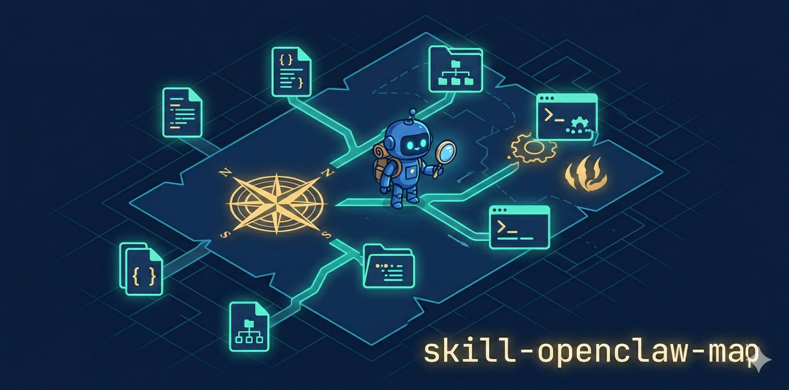

<p align="center">
  
</p>

<h1 align="center">skill-openclaw-map</h1>

<p align="center">
  <strong>Give your coding agent a complete map of the <a href="https://openclaw.ai">OpenClaw</a> environment.</strong><br>
  Config · Logs · Cron Jobs · Sessions · Skills · Docs — no exploring from scratch.
</p>

<p align="center">
  <a href="https://agentskills.io"></a>
  <a href="https://github.com/wsxqaza12/skill-openclaw-map/actions/workflows/check-drift.yml"></a>
  <a href="https://github.com/wsxqaza12/skill-openclaw-map/stargazers"></a>
</p>

<p align="center">
  <strong>English</strong> | <a href="docs/README.zh-TW.md">繁體中文</a>
</p>

## Who is this for

Anyone using a coding agent (GitHub Copilot, Claude Code, Cursor, Codex, etc.) to work on an OpenClaw installation. Install this skill once, and your agent instantly knows the entire file structure.

## Install

This repo follows the [Agent Skills](https://agentskills.io/) open standard.

1. **`cd` into the OpenClaw home directory**

   ```bash
   cd ~/.openclaw
   ```

2. **Clone this repo into your agent's project-level skills directory**

   | Agent | Command |
   |---|---|
   | Claude Code | `git clone https://github.com/wsxqaza12/skill-openclaw-map .claude/skills/openclaw-map` |
   | Cursor | `git clone https://github.com/wsxqaza12/skill-openclaw-map .cursor/skills/openclaw-map` |
   | Codex | `git clone https://github.com/wsxqaza12/skill-openclaw-map .codex/skills/openclaw-map` |
   | AntiGravity | `git clone https://github.com/wsxqaza12/skill-openclaw-map .agent/skills/openclaw-map` |
   | GitHub Copilot | [Custom Instructions](https://docs.github.com/en/copilot/customizing-copilot/adding-custom-instructions-for-github-copilot) |

3. **Open `~/.openclaw/` in your coding agent and start working**

   Point your coding agent at `~/.openclaw/`. It will automatically discover the skill and use it to locate everything it needs.

## What it covers

- `~/.openclaw/` directory layout
- Agent workspace and bootstrap files (`AGENTS.md`, `SOUL.md`, etc.)
- Session transcript paths
- Cron job format and CLI commands
- Skills loading priority
- Gateway daemon management
- Log file locations
- How to find bundled OpenClaw docs on any OS

## Maintenance

Content is static. A weekly [GitHub Action](.github/workflows/check-drift.yml) checks for structural changes in the latest OpenClaw release and opens an issue when drift is detected.

To update:
1. Update `references/environment.md`
2. Run `scripts/update-baseline.sh` to refresh the baseline
3. Open a PR
